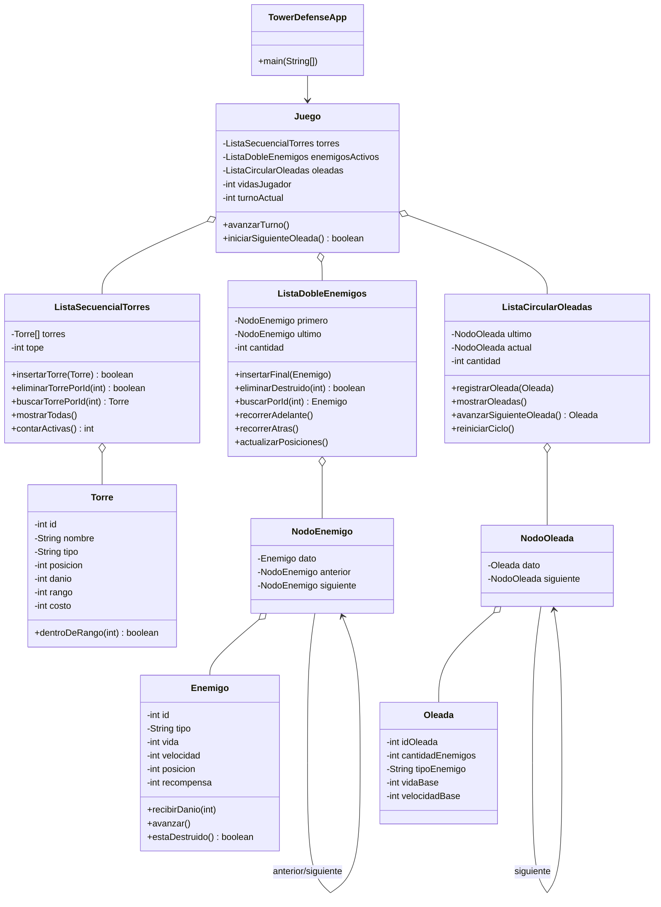

```mermaid
classDiagram
    class Torre {
        -int id
        -String nombre
        -String tipo
        -int posicion
        -int danio
        -int rango
        -int costo
        +dentroDeRango(int) boolean
    }
    class Enemigo {
        -int id
        -String tipo
        -int vida
        -int velocidad
        -int posicion
        -int recompensa
        +recibirDanio(int)
        +avanzar()
        +estaDestruido() boolean
    }
    class Oleada {
        -int idOleada
        -int cantidadEnemigos
        -String tipoEnemigo
        -int vidaBase
        -int velocidadBase
    }
    class NodoEnemigo {
        -Enemigo dato
        -NodoEnemigo anterior
        -NodoEnemigo siguiente
    }
    class NodoOleada {
        -Oleada dato
        -NodoOleada siguiente
    }
    class ListaSecuencialTorres {
        -Torre[] torres
        -int tope
        +insertarTorre(Torre) boolean
        +eliminarTorrePorId(int) boolean
        +buscarTorrePorId(int) Torre
        +mostrarTodas()
        +contarActivas() int
    }
    class ListaDobleEnemigos {
        -NodoEnemigo primero
        -NodoEnemigo ultimo
        -int cantidad
        +insertarFinal(Enemigo)
        +eliminarDestruido(int) boolean
        +buscarPorId(int) Enemigo
        +recorrerAdelante()
        +recorrerAtras()
        +actualizarPosiciones()
    }
    class ListaCircularOleadas {
        -NodoOleada ultimo
        -NodoOleada actual
        -int cantidad
        +registrarOleada(Oleada)
        +mostrarOleadas()
        +avanzarSiguienteOleada() Oleada
        +reiniciarCiclo()
    }
    class Juego {
        -ListaSecuencialTorres torres
        -ListaDobleEnemigos enemigosActivos
        -ListaCircularOleadas oleadas
        -int vidasJugador
        -int turnoActual
        +avanzarTurno()
        +iniciarSiguienteOleada() boolean
    }
    class TowerDefenseApp {
        +main(String[])
    }

    ListaSecuencialTorres o-- Torre
    ListaDobleEnemigos o-- NodoEnemigo
    NodoEnemigo o-- Enemigo
    NodoEnemigo --> NodoEnemigo : anterior/siguiente
    ListaCircularOleadas o-- NodoOleada
    NodoOleada o-- Oleada
    NodoOleada --> NodoOleada : siguiente
    Juego o-- ListaSecuencialTorres
    Juego o-- ListaDobleEnemigos
    Juego o-- ListaCircularOleadas
    TowerDefenseApp --> Juego
```
