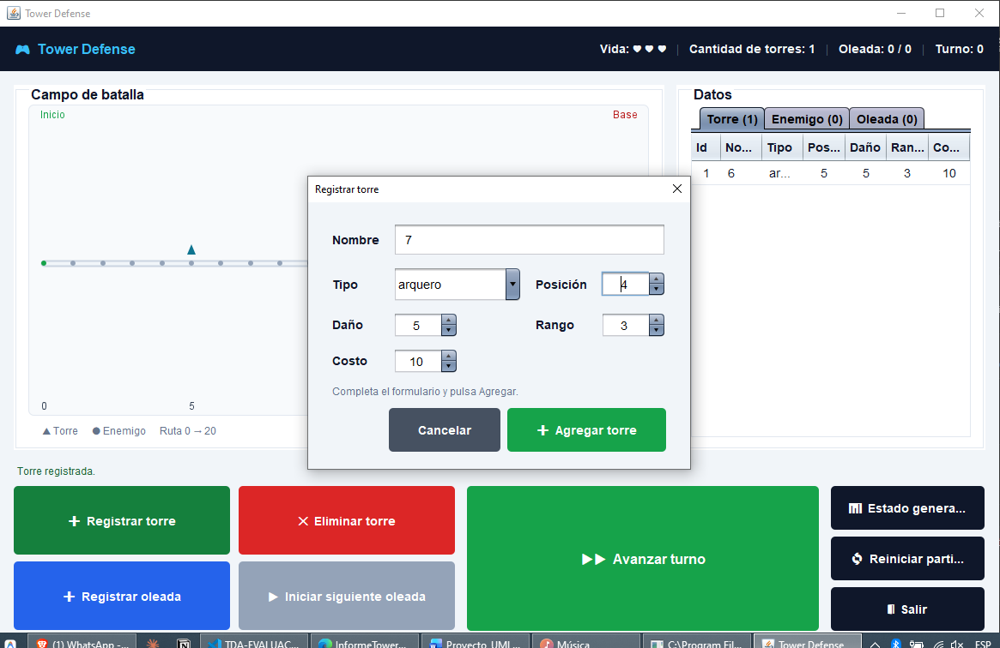
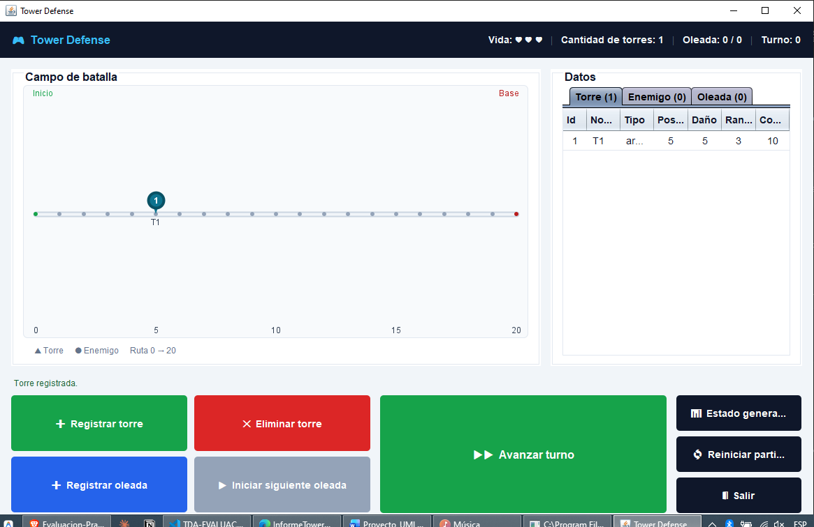

# Tower Defense: Listas Secuenciales, Doble y Circular en Java

## Descripcion

Prueba practica de Estructura de Datos (UTA, Nivel III): mini simulador de un
juego de **Tower Defense**. El objetivo pedagogico de la guia es evaluar el
uso de tres estructuras de datos lineales **implementadas a mano**, sin
`java.util`: lista secuencial (arreglo), lista doblemente enlazada y lista
simplemente enlazada circular.

Además del enunciado original (menú de consola), se agregó una **interfaz
gráfica en Swing** por pedido del docente. Ambas interfaces (consola y GUI)
comparten exactamente la misma lógica de `negocio/` y `modelo/` sin
duplicarla — ver [Interfaz gráfica](#interfaz-gráfica-swing) más abajo.

### Enunciado

CASO DE ESTUDIO: TOWER DEFENSE CON LISTAS SECUENCIALES, DOBLES Y CIRCULARES EN JAVA

Disenar y desarrollar un mini sistema de juego en Java, inspirado en un
Tower Defense, que demuestre el uso correcto de tres estructuras de datos
lineales implementadas a mano (sin colecciones de `java.util`).

**Contexto:** el jugador defiende un territorio de oleadas de enemigos que
avanzan por una ruta hacia una base, usando torres defensivas que atacan
automaticamente a los enemigos dentro de su rango.

**Estructuras de datos obligatorias:**

1. **Lista secuencial** (arreglo) para las torres defensivas: `Torre` (id,
   nombre, tipo, posicion, danio, rango, costo); insertar, eliminar por id,
   buscar por id, mostrar todas, contar activas.
2. **Lista doblemente enlazada** con referencia a primero y ultimo para los
   enemigos activos: `NodoEnemigo` sobre `Enemigo` (id, tipo, vida,
   velocidad, posicion, recompensa); insertar al final, eliminar destruido,
   buscar por id, recorrer adelante y atras, actualizar posicion.
3. **Lista simplemente enlazada circular** con referencia a ultimo para las
   oleadas: `NodoOleada` sobre `Oleada` (idOleada, cantidadEnemigos,
   tipoEnemigo, vidaBase, velocidadBase); registrar, mostrar, avanzar a la
   siguiente oleada, reiniciar el ciclo.

**Reglas del juego:** ruta lineal de posiciones 0 a 20; los enemigos
aparecen en la posicion 0 y avanzan segun su velocidad en cada turno; las
torres atacan automaticamente a los enemigos dentro de su rango; un enemigo
con vida 0 se elimina; un enemigo que llega al final de la ruta resta una
vida al jugador; la partida termina cuando el jugador pierde todas sus
vidas o se completan todas las oleadas definidas.

**Menu requerido (10 opciones):** registrar torre defensiva, mostrar torres
registradas, eliminar torre, registrar oleada, mostrar oleadas, iniciar
siguiente oleada, avanzar turno, mostrar enemigos activos, mostrar estado
general del juego, salir.

**Restricciones tecnicas:** lenguaje obligatorio Java; estructuras
implementadas manualmente con arreglos y referencias entre objetos;
prohibido usar `ArrayList`, `LinkedList`, `Queue`, `Deque` o colecciones
similares; se permite `Scanner` y `String`; clases separadas en archivos
`.java`, con `TowerDefenseApp` como clase con el metodo `main`.

**Entregables:** archivos fuente `.java` compilables y ejecutables;
capturas de pantalla de la ejecucion; breve explicacion del uso de cada
estructura de datos; diagrama simple de clases o de estructuras
utilizadas; invitar al docente como colaborador del repositorio de GitHub.

### Solucion propuesta

| Estructura | Tipo | Para que sirve |
|---|---|---|
| Lista secuencial de torres | `Torre[]` + `int tope` | torres colocadas por el jugador |
| Lista doble de enemigos | `NodoEnemigo` (primero/ultimo) | enemigos activos que avanzan por la ruta |
| Lista circular de oleadas | `NodoOleada` (ultimo) | ciclo de oleadas por lanzar |

El programa tiene estas clases:

| Clase | Responsabilidad |
|---|---|
| `Torre` | Datos de una torre defensiva; calcula si un enemigo esta dentro de su rango |
| `Enemigo` | Datos de un enemigo; recibe danio y avanza por la ruta |
| `Oleada` | Definicion de una oleada (cantidad, tipo, vida y velocidad base) |
| `NodoEnemigo` | Envuelve a un `Enemigo` con `anterior`/`siguiente` para la lista doble |
| `NodoOleada` | Envuelve a una `Oleada` con `siguiente` para la lista circular |
| `ListaSecuencialTorres` | Arreglo estatico de `Torre` con `tope`; CRUD de torres |
| `ListaDobleEnemigos` | Lista doble de `NodoEnemigo`; insertar, eliminar, buscar, recorrer |
| `ListaCircularOleadas` | Lista circular de `NodoOleada`; registrar, mostrar, avanzar, reiniciar |
| `Juego` | Orquesta las tres estructuras y la logica de turnos |
| `TowerDefenseApp` | Clase con el `main` y el menu de 10 opciones |

### Modelo de dominio

- **`Torre`:** colocada en una posicion fija de la ruta; ataca
  automaticamente a cualquier `Enemigo` que entre en su rango
  (`dentroDeRango`).
- **`Enemigo`:** aparece en la posicion 0 de una ruta de longitud 20,
  avanza segun su velocidad en cada turno, recibe danio de las torres en
  rango y se elimina si su vida llega a 0 o si alcanza el final de la ruta
  (en ese caso resta una vida al jugador).
- **`Oleada`:** define cuantos enemigos, de que tipo, con que vida y
  velocidad base aparecen en un ciclo del juego.
- **`Juego`:** vida inicial del jugador 3, ruta de longitud 20. Cada turno
  genera enemigos de la oleada en curso, mueve a los enemigos activos,
  aplica el danio de las torres en rango, elimina a los destruidos,
  descuenta vidas a los que llegaron al final, y verifica si la partida
  termina (por vidas en 0 o por completar todas las oleadas registradas).

### Decisiones de diseno

- El enemigo y la torre no usan herencia ni polimorfismo: el enunciado no
  pide una jerarquia de tipos, solo tres estructuras de datos lineales.
- Las torres se guardan en un arreglo estatico de tamano fijo
  (`MAX_TORRES = 20`) con un contador `tope`, sin redimensionar, tal como
  pide la lista secuencial del enunciado.
- Los enemigos se guardan en una lista doblemente enlazada con referencia
  a `primero` y `ultimo`, lo que permite insertar al final en O(1) y
  recorrer en ambos sentidos, aunque el juego en si solo recorra hacia
  adelante en cada turno.
- Las oleadas se guardan en una lista circular donde el `siguiente` del
  ultimo nodo apunta siempre al primero; `reiniciarCiclo` existe como
  operacion aparte para reiniciar el ciclo explicitamente.
- La partida gana cuando se han iniciado tantas oleadas como las
  registradas y ya no quedan enemigos activos ni por generar; pierde si
  las vidas llegan a 0.
- Vida inicial del jugador: 3. Longitud de la ruta: 20 posiciones (0 a
  20). El enunciado no pide puntuacion, asi que no se implemento.
- El menu de 10 opciones de consola se conserva en `TowerDefenseApp`.
  La interfaz grafica Swing (`gui.TowerDefenseGUI`) cubre las mismas
  10 opciones en una sola pantalla tipo tablero (campo de batalla,
  datos y botones siempre visibles), sin tocar `modelo/` ni `negocio/`.
- No se permiten dos torres en la misma posicion de la ruta
  (`ListaSecuencialTorres.existePosicion`); tampoco se aceptan oleadas
  con cantidad, vida base o velocidad base menores o iguales a 0 (una
  velocidad 0 dejaria enemigos que nunca avanzan ni mueren, trabando la
  partida). Ambas reglas se validan una sola vez en `Juego` y las usan
  por igual la consola y la GUI.
- `generarEnemigoDeOleada()` marca la oleada como terminada en el mismo
  turno en que genera su ultimo enemigo, no en el turno siguiente; asi
  `iniciarSiguienteOleada()` y la deteccion de victoria no se atrasan un
  turno de mas.

### Conceptos aplicados

| Requisito | Java |
|---|---|
| Lista secuencial (arreglo) | `Torre[] torres` + `int tope` en `ListaSecuencialTorres` |
| Lista doblemente enlazada | `NodoEnemigo` con `anterior`/`siguiente`, primero/ultimo, en `ListaDobleEnemigos` |
| Lista simplemente enlazada circular | `NodoOleada` con referencia a `ultimo`, en `ListaCircularOleadas` |
| Encapsulamiento | atributos `private` con getters/setters en todas las clases de `modelo/` |
| Sin colecciones de `java.util` | Todo implementado a mano con arreglos y referencias entre objetos |

## Estructura del proyecto

Arquitectura en 4 paquetes:

- `Java/src/modelo/`  -> `Torre`, `Enemigo`, `Oleada`, `NodoEnemigo`, `NodoOleada`
- `Java/src/negocio/` -> `ListaSecuencialTorres`, `ListaDobleEnemigos`, `ListaCircularOleadas`, `Juego`
- `Java/src/app/`     -> `Main` (punto de entrada, elige modo), `TowerDefenseApp` (menu de consola)
- `Java/src/gui/`     -> interfaz Swing (`TowerDefenseGUI`, `MainFrame`, `JuegoControl`,
  `EstiloGui`, `RutaVisual`, `DatosPanel`, `DialogoTorre`, `DialogoOleada`,
  `PantallaFinPartida`, `EstadoPanel`); no modifica modelo ni negocio

## Interfaz gráfica (Swing)

Ventana única tipo tablero: barra de estado (vidas, torres, oleada,
turno), campo de batalla con mini mapa de la ruta 0→20 (torres como
pines con su número y nombre, enemigos como puntos), panel de datos con
pestañas Torre/Enemigo/Oleada, y todos los botones de acción siempre
visibles — sin pestañas que escondan el resto del juego. Al ganar o
perder aparece un overlay de pantalla completa con el resultado. El
diseño completo está en
[`diagramas/diseno-gui.md`](diagramas/diseno-gui.md); cómo se conecta con
`Juego` sin tocar `negocio/` se explica en
[`diagramas/diagrama-arquitectura.md`](diagramas/diagrama-arquitectura.md).

| Tablero inicial | Torre registrada |
|---|---|
|  |  |

| Victoria | Derrota |
|---|---|
|  |  |

Más capturas (diálogos, estado general, reinicio) y la ejecución en
consola están en [`ejecucion/`](ejecucion/).

## Diagramas

- Diagrama de clases (`modelo/` y `negocio/`): [`diagramas/diagrama-clases.md`](diagramas/diagrama-clases.md) (Mermaid) y `diagramas/diagrama-clases.png` (render)
- Diagrama de arquitectura (paquetes `app`/`gui`/`negocio`/`modelo`): [`diagramas/diagrama-arquitectura.md`](diagramas/diagrama-arquitectura.md)
- Diagrama de secuencia de un turno + diagrama de estados de la partida: [`diagramas/diagrama-turno-y-estados.md`](diagramas/diagrama-turno-y-estados.md)
- Diseño de la interfaz gráfica (wireframes y decisiones de UI): [`diagramas/diseno-gui.md`](diagramas/diseno-gui.md)
- Capturas de ejecución (consola y GUI, victoria y derrota): [`ejecucion/`](ejecucion/)

## Como ejecutar

Desde `Java/src`, compilando todo junto (consola y GUI comparten la
misma salida):

```bash
javac -encoding UTF-8 -d ../out modelo/*.java negocio/*.java app/*.java gui/*.java
```

**Punto de entrada unico (recomendado):** pregunta el modo al arrancar.

```bash
java -cp ../out app.Main
```

**Directo a un modo especifico**, si prefieres saltarte la pregunta:

```bash
java -cp ../out app.TowerDefenseApp   # consola
java -cp ../out gui.TowerDefenseGUI   # interfaz grafica
```

## Equipo

| Rol | Integrante |
|---|---|
| Lider | Chico Yunda Juan Carlos |
| Backend - Negocio y logica del juego | Chico Yunda Juan Carlos |
| Backend - Modelo y estructuras | Guanoquiza Aguaguiña Justin Alexander |
| Documentacion - Informe y diagramas | Tacuri Santillan Mónica Sara |
