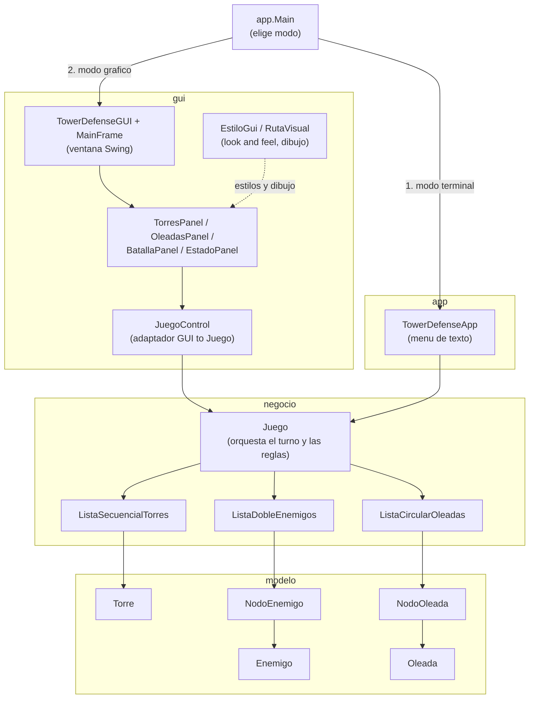

# Diagrama de arquitectura (paquetes y componentes)

Muestra cómo se conectan los cuatro paquetes del proyecto y las dos formas
de ejecutar el juego (consola y GUI) desde el punto de entrada único
`app.Main`. Ninguna de las dos interfaces modifica `negocio/` ni `modelo/`:
ambas solo llaman a los métodos públicos de `Juego`.

## Por qué existe `JuegoControl`

`Juego` expone sus datos casi siempre a través de métodos que imprimen
texto en consola (`mostrarTorres()`, `mostrarEstadoGeneral()`, etc.), lo
cual funciona bien para el menú de texto pero no le sirve a la GUI, que
necesita datos estructurados para llenar tablas (`JTable`). `JuegoControl`
resuelve esto sin tocar `negocio/`: captura esa misma salida de texto con
un `PrintStream` temporal y la convierte en listas de objetos
(`Torre`, `Oleada`, `FilaEnemigo`) y en un objeto `EstadoPartida`. Así la
lógica de negocio se mantiene intacta y ambas interfaces (consola y GUI)
terminan mostrando exactamente la misma información.
