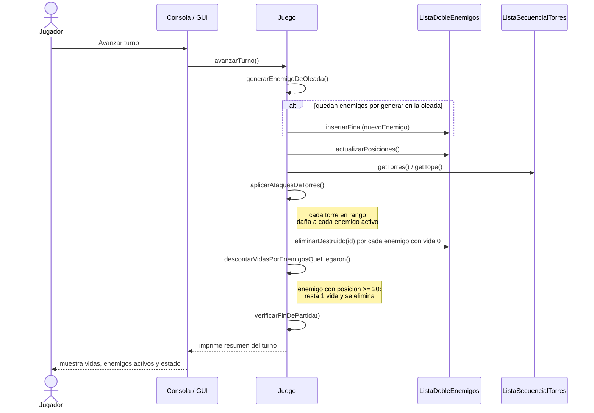
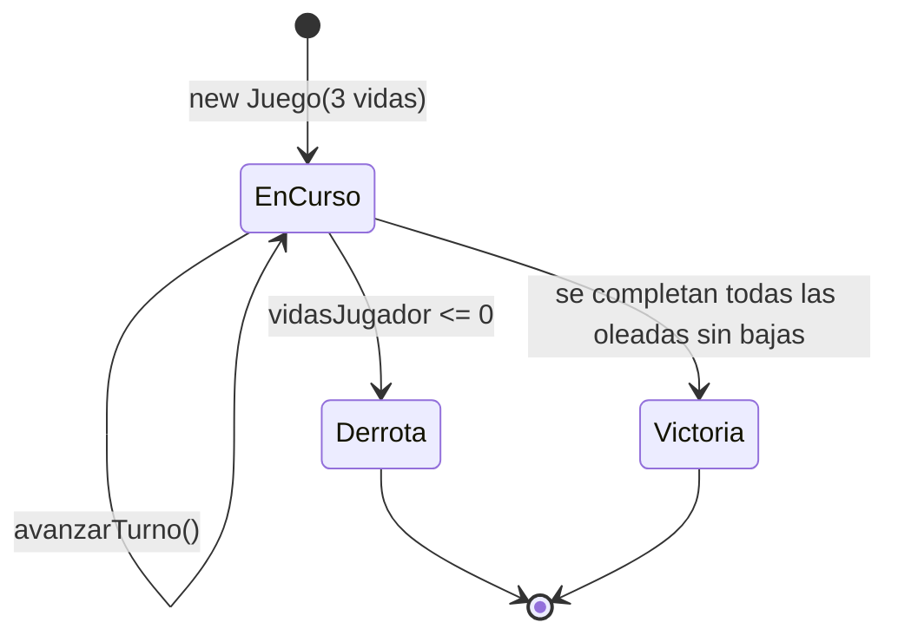

# Diagrama de secuencia (avanzar turno) y de estados (partida)

## Secuencia de `avanzarTurno()`

Detalla el orden exacto de las operaciones dentro de un turno. Este orden
importa: por ejemplo, `generarEnemigoDeOleada()` marca la oleada como
terminada apenas se genera el último enemigo (no un turno después), para
que `iniciarSiguienteOleada()` quede disponible de inmediato.

## Estados de la partida

Una vez en `Derrota` o `Victoria`, `partidaTerminada` queda en `true` y
tanto `avanzarTurno()` como `iniciarSiguienteOleada()` rechazan cualquier
acción nueva (en la GUI, los botones correspondientes se deshabilitan).
