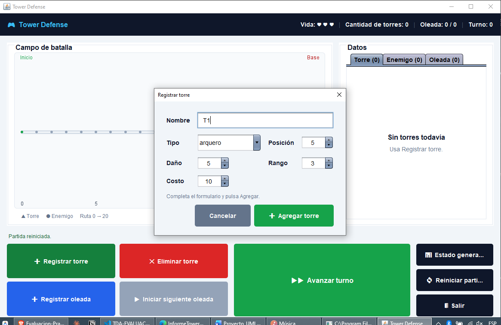
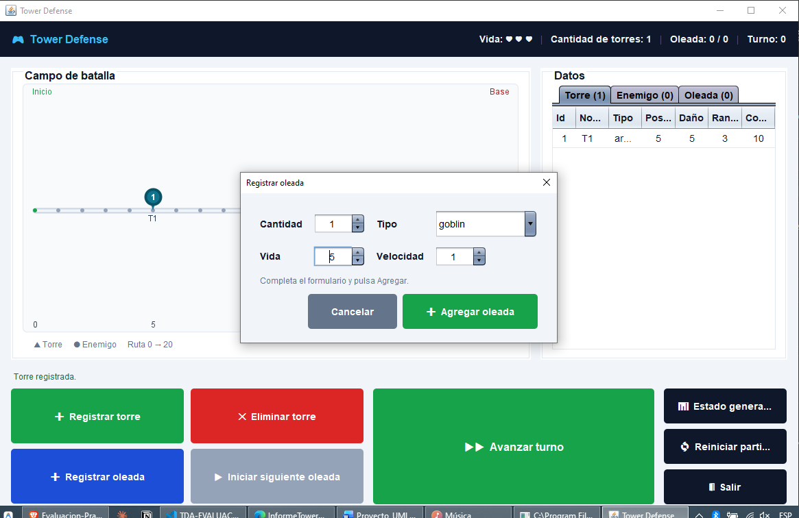
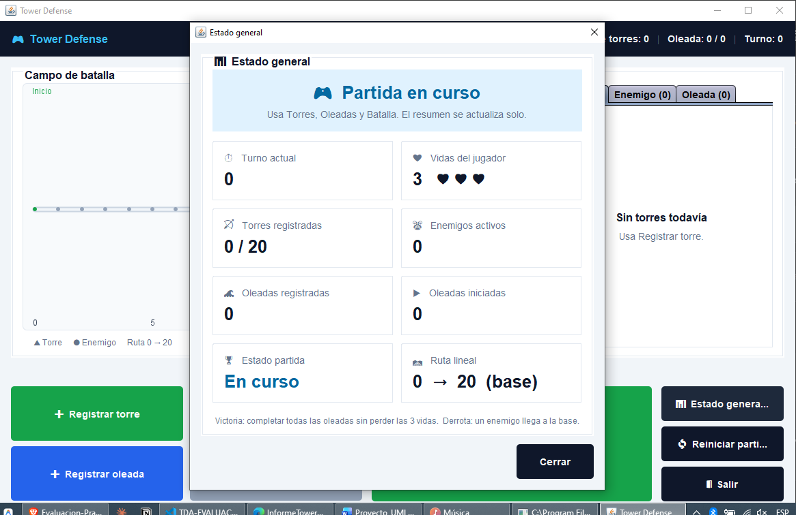
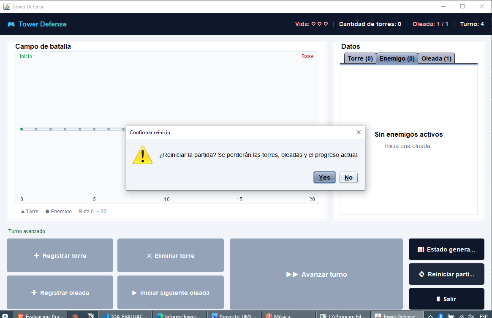
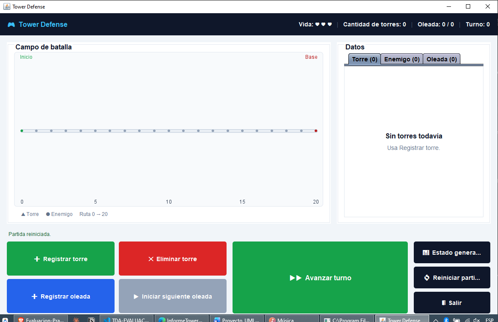

# Ejecución en interfaz gráfica (Swing)

Capturas reales de `gui.TowerDefenseGUI` (o `app.Main`, opción 2),
mostrando el mismo recorrido que la versión de consola: registrar una
torre y una oleada, ganar una partida, perder otra, reiniciar y revisar
el estado general.

## 1. Tablero inicial

Pantalla única con el campo de batalla (ruta 0→20), el panel de datos
con pestañas Torre/Enemigo/Oleada a la derecha, y todos los botones de
acción abajo — sin partida iniciada todavía.

## 2. Diálogo "Registrar torre"

El botón "+ Registrar torre" abre un formulario emergente con nombre,
tipo, posición, daño, rango y costo, con validación antes de guardar.

## 3. Torre en el mapa

Tras agregarla, la torre aparece como un pin en el campo de batalla
(número de id + nombre debajo) y como fila en la pestaña "Torre" del
panel de datos.

## 4. Diálogo "Registrar oleada"

Igual que con las torres, "+ Registrar oleada" abre un formulario con
cantidad, tipo, vida base y velocidad base.

## 5. Victoria

Con una torre fuerte cerca del inicio de la ruta y una oleada de un solo
enemigo débil, al avanzar turnos la torre lo destruye antes de que
complete el recorrido. Aparece automáticamente el overlay de pantalla
completa "🏆 ¡VICTORIA!" — las vidas quedan intactas.

## 6. Estado general

El botón "Estado general" abre un resumen con turno, vidas, torres,
enemigos, oleadas y el estado de la partida en tarjetas.

## 7. Derrota

En una partida sin torres, con enemigos veloces, varios llegan a la
base y las vidas bajan a 0. Aparece el mismo overlay de pantalla
completa, esta vez en rojo: "💀 DERROTA".

## 8. Confirmar reinicio

Cerrado el overlay, los botones de juego quedan bloqueados hasta que se
reinicia. "Reiniciar partida" pide confirmación antes de borrar el
progreso.

## 9. Partida reiniciada

Tras confirmar, el tablero vuelve al estado inicial (vidas, torres,
oleadas y turno en cero) sin cerrar la ventana.
