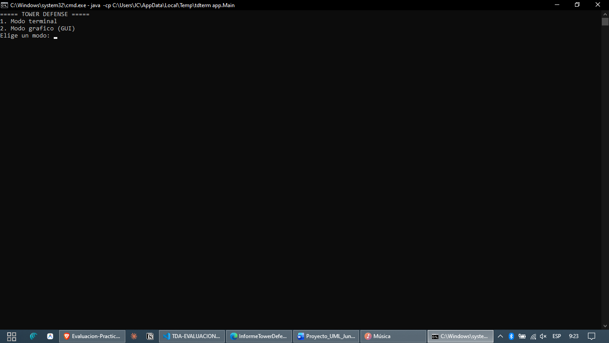
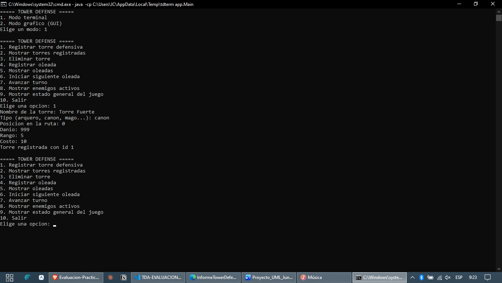
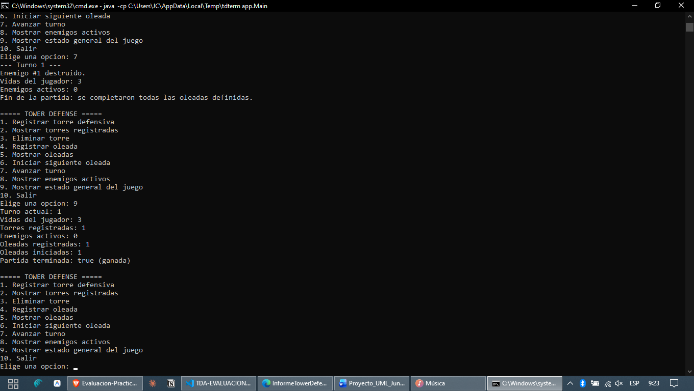
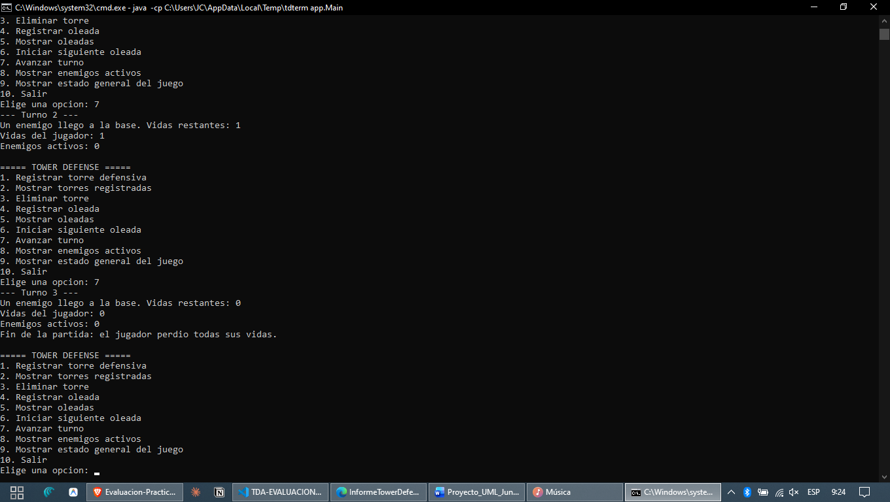
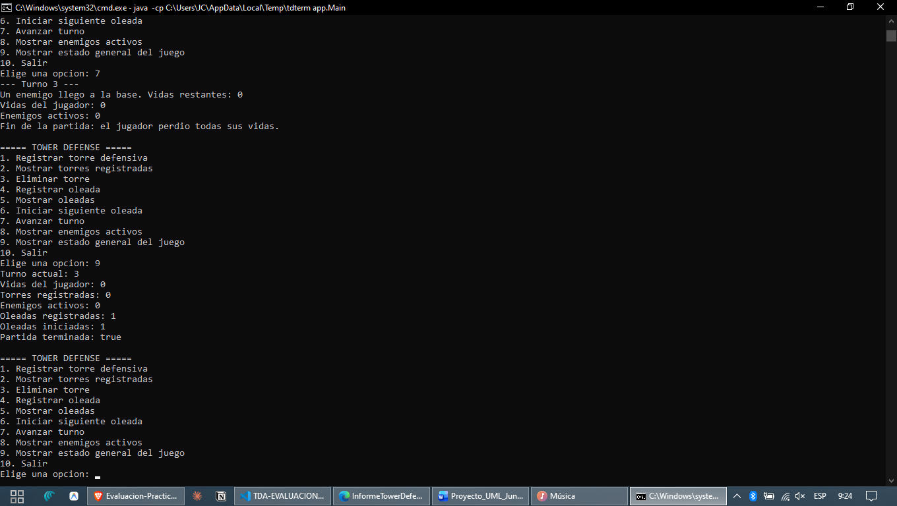

# Ejecución en terminal (consola)

Capturas reales de `app.Main` en modo consola (opción 1), mostrando una
partida que termina en victoria y otra que termina en derrota. Todo lo
que aparece en pantalla es la salida real del programa, sin editar.

## 1. Menú inicial

Al ejecutar `java -cp out app.Main` el programa pregunta el modo
(terminal o gráfico). Eligiendo `1` entra al menú de consola con las 10
opciones del enunciado.

## 2. Registrar una torre

Opción `1`: se piden nombre, tipo, posición, daño, rango y costo por
consola, uno por uno. La torre queda guardada en la lista secuencial
(`ListaSecuencialTorres`) con id 1.

## 3. Partida ganada

Se registra una oleada de un solo enemigo débil (opción `4`), se inicia
(opción `6`) y se avanza un turno (opción `7`): la torre lo destruye
antes de que llegue a la base. Al no quedar enemigos ni oleadas
pendientes, "Mostrar estado general" (opción `9`) confirma
`Partida terminada: true (ganada)`.

## 4. Partida perdida — turnos

En una partida nueva se registra una oleada de 3 enemigos rápidos
(velocidad 25) **sin ninguna torre defensiva**. Cada enemigo llega a la
base y resta una vida: se ve el mensaje
`Un enemigo llego a la base. Vidas restantes: ...` bajando de 1 a 0.

## 5. Partida perdida — estado final

Con las vidas en 0, el juego marca el fin de la partida
(`Fin de la partida: el jugador perdio todas sus vidas.`) y
"Mostrar estado general" confirma `Partida terminada: true` (sin
"ganada").
